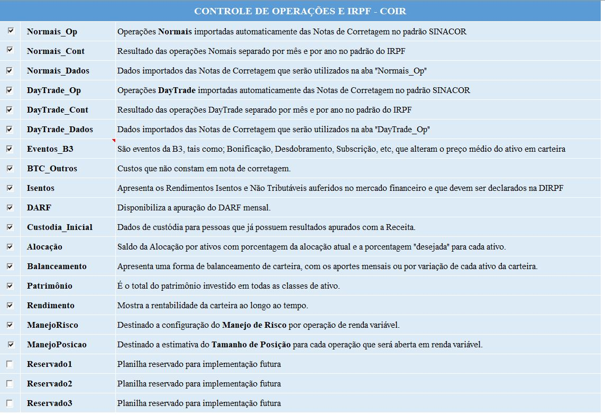
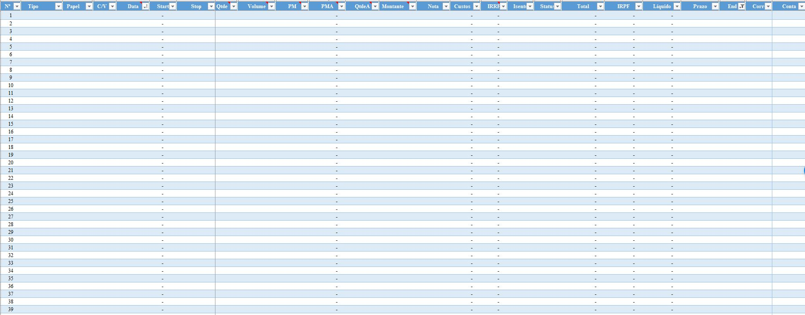
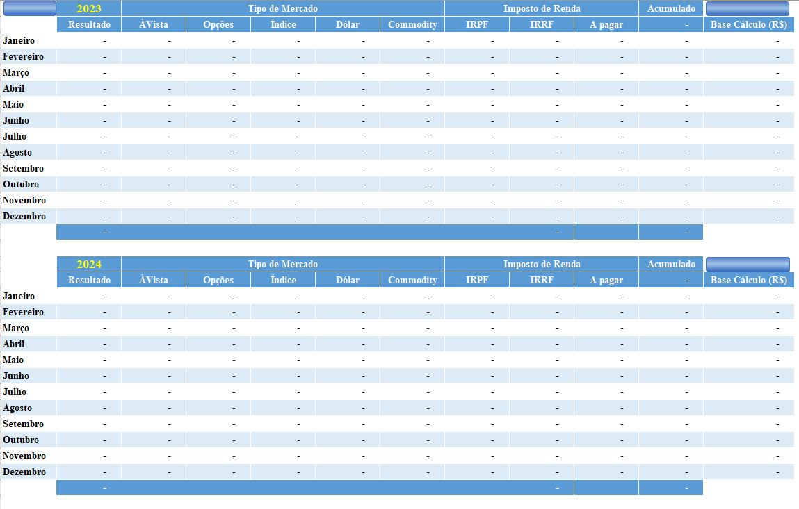
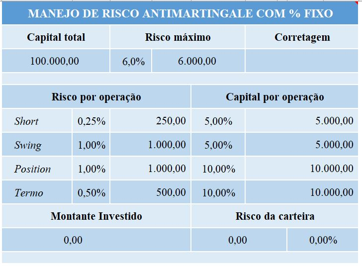

# Controle de Operações e Imposto de Renda - COIR
O COIR é um sistema de extração de dados de notas de corretagens no padrão SINACOR (Sistema Integrado de Administração de Corretoras) para planilhas do Microsoft Excel. Tem como objetivo o controle de operações nos mercados Á Vista (Normal e DayTrade), Futuros, Commodities e Derivativos (Opções), na bolsa de valores da B3 (Brasil, Bolsa e Balcão).

***
## História
Esse controle de operações começou em 2017, inicalmente apenas em planilhas excel com operações do mercado À Vista. Em 2021 nasceu a necessidade de automatização da extração de dados das notas de corretegens, até então todo esse trabalho era realizado de forma manual. Para essa automatização é utilizada a linguagem de programação Python. Em 2022 foram acrescentado os controles de operações dos mercados de Futuros, Commodities e Derivativos (Opções).

Desde o início, o objetivo desse controle foi a simplicidade e correção dos dados extraídos e contabilizados. Algumas das principais características do COIR são:
* Controle separado por CPF
* Possibilidade de contabilizar notas de corretagens de corretoras diferentes para um mesmo CPF
* Contabilizar operações para cada tipo de mercado (Á Vista, Futuros, Commodities e Derivativos)
* Apuração mensal da DARF

Atualmente o sistema consegue manipular notas de corretagens das corretoras XP, Clear, Rico, Necton e BTG.

***
## Plataforma
Para ter acesso a todas as funcionalidades do sistema será necessário o Microsoft Excel e o software Python.
* Descompacte e copie todo o conteúdo baixado para uma pasta de seu interesse.
* Baixe suas notas de corretagem no padrão SINACOR direto do portal de sua corretora.
   * O sistema foi testado apenas para as corretoras XP, Clear, Rico, Necton e BTG.
* Copie as cotas de corretagens baixadas para a pasta “..\Entrada”.
* Execute o programa “COIR.py”, que se encontra na pasta principal.
   * Para isso é necessário que o Python 3 estaja instalado em sua máquina, Python 3.9.2 ou superior, preferencialmente.
   * Ele pode ser baixando do endereço https://www.python.org/downloads/
   * Após o download e instalação do python execute o script “COIR.py”
   * Na primeira execução do script serão instaladas algumas bibliotecas não nativas do Python e que são necessárias para a correta execução do COIR.py. Essa instalação é automática
* Após concluídas as instalações o programa fará a exportação das Nota de Corretagens presentes na pasta “..\Entrada” automaticamente.
* As notas de corretagem processadas serão movidas da pasta “..\Entrada” para a pasta “..\Saída”.
* O resultado da extração das notas de corretagens será inserido em 2 arquivos:
   * ..\Resultado\CPF\Completo.xlsx – que contém o resultado bruto da extração de todas as notas.
   * ..\Resultado\CPF\COIR.xlsm – que contém os dados extraídos das notas de corretagem em várias planilhas (Normais, Daytrade, Contabilidade, DARF, isentos, entre outras).

Contribuições são muito bem-vindas!

***
## Recursos
A seguir são apresentadas, de forma resumida, as funcionalidades das planilhas do COIR:

1. Indice - Acesso, habilitação e descrição de cada uma das planilhas do COIR.
1. Normais_Op - Operações Normais importadas automaticamente das notas de corretagens no padrão SINACOR.
1. Normais_Cont - Resultado das operações Nomais, separado por mês e por ano no padrão do IRPF.
1. Normais_Dados - Dados importados das notas de corretagens que serão utilizados na aba "Normais_Op".
1. DayTrade_Op - Operações DayTrade importadas automaticamente das notas de corretagens no padrão SINACOR.
1. DayTrade_Cont - Resultado das operações DayTrade separado por mês e por ano no padrão do IRPF
1. DayTrade_Dados - Dados importados das notas de corretagens que serão utilizados na aba "DayTrade_Op"
1. Eventos B3 - São eventos da B3, tais como; Bonificação, Desdobramento, Grupamento, Subscrição, que alteram o preço médio do ativo em carteira e que não constão das notas de corretagens.
1. Isentos - Apresenta os Rendimentos Isentos e Não Tributáveis auferidos no mercado financeiro e que devem ser declarados na DIRPF
1. DARF - Disponibiliza os dados para a apuração do DARF mensal.
1. Custodia inicial - Dados de custódia para pessoas que já possuem resultados apurados com a Receita.
1. Alocação - Saldo da Alocação por ativos com porcentagem da alocação atual e a porcentagem "desejada" para cada ativo.
1. Balanceamento - Apresenta uma forma de balanceamento de carteira, com os aportes mensais ou por variação de cada ativo da carteira.
1. Patrimônio - É o total do patrimônio investido em todas as classes de ativo.
1. Rendimento - Mostra a rentabilidade da carteira ao longo ao tempo.
1. ManejoRisco - Destinado a configuração do Manejo de Risco por operação de renda variável.
1. ManejoPosicao - Destinado a estimativa do Tamanho de Posição para cada operação que será aberta em renda variável.
1. Reservado0 - Planilha reservado para implementação futura.
1. Reservado1 - Planilha reservado para implementação futura.
1. Reservado2 - Planilha reservado para implementação futura.
1. Reservado3 - Planilha reservado para implementação futura.

***
## Capturas de telas
Tela principal

***
Índice

***
Controle das operações realizadas

Contabilidade das operações realizadas

Alocação por classe de ativo

Controle de operações isentas de IR

Controle de DARF mensal

Eventos da B3

Custódia inicial

Balanceamento da carteira

Manejo de risco antimartingale com porcentagem fixa por tipo de operação

***
## Implementações futuras
